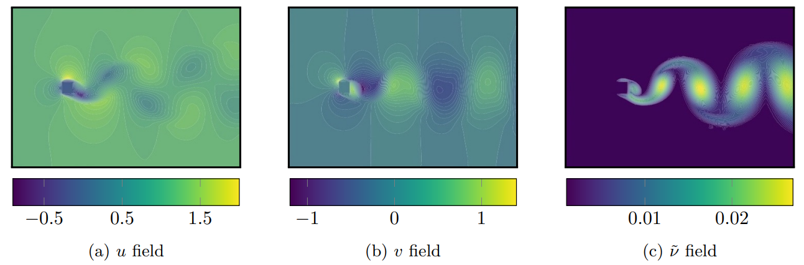

# Robust Deep Learning For Emulating Turbulent Viscosities 
[](https://aip.scitation.org/doi/10.1063/5.0064458) 
[](https://doi.org/10.1063/5.0064458)  


###
<p align="center">
  
</p>


### Abstract:
From the simplest models to complex deep neural networks, modeling turbulence with machine learning techniques still offers multiple challenges. In this context, the present contribution proposes a robust strategy using patch-based training to learn turbulent viscosity from flow velocities, and demonstrates its efficient use on the Spallart-Allmaras turbulence model. Training datasets are generated for flow past two-dimensional obstacles at high Reynolds numbers and used to train an auto-encoder type convolutional neural network with local patch inputs. Compared to a standard training technique, patch-based learning not only yields increased accuracy but also reduces the computational cost required for training.

### Article: https://aip.scitation.org/doi/abs/10.1063/5.0064458

### Requirements:
1. scipy==1.3.1
2. vtk==8.1.2
3. tqdm==4.37.0
4. numpy==1.17.3
5. tensorflow==2.0.0
6. matplotlib==3.2.1
7. tqdm==4.37.0

### Usage:
#### Download
```bash
git clone https://github.com/aakash30jan/RobustDL_Turbulence
```
If git is not installed, you can get the source zip with
```bash
wget -O RobustDLTurbulence.zip https://github.com/aakash30jan/RobustDL_Turbulence/archive/refs/heads/main.zip 
unzip RobustDLTurbulence.zip
```

#### Install Requirements
```bash
cd transport
pip install -r requirements.txt
cd train
pip install -r requirements.txt
```
Make sure you install TF2.0 with GPU support.  

#### Pre-process the training data
Make sure the training data is stored at `case_dir`  
```bash
cd transport
python3 preprocess.py
```
The current `preprocess.py` looks for `.vtu` files in `case_sample/resultats/2d/bulles*.vtu` . Modify the `case_dir`, `resultats_dir`, `fileListVTU` to accomodate your training dataset containing `.vtu` files of interest. 

#### Train the model
```console
cd train
make train
```
You may clean the previous training data, if any, by 
```console
cd train
make clean
```
The file train.py is self-explanatory: We first load the system and user-defined libraries, set the training parameters, load the pre-processed dataset, make a patched-data, load the model architectures, define training and validation steps to suit TF2.0, and then perform the training. Make sure cuda-capabale devices and drivers are visible to Tensorflow, you may need to `module load cudaxxx` depending on the machine configuration. 

### Issues:
Problems? Please raise an issue at [https://github.com/aakash30jan/RobustDL_Turbulence/issues](https://github.com/aakash30jan/RobustDL_Turbulence/issues).

[](#RobustDL_Turbulence)  [](#RobustDL_Turbulence)

### Citation:
Please use https://doi.org/10.1063/5.0064458 for citing this code or article. You may also download [this](https://scholar.googleusercontent.com/scholar.bib?q=info:_D9NJ40fE7QJ:scholar.google.com/&output=citation&scisdr=CgXM4NgCEPTclG-CX-E:AAGBfm0AAAAAYYGHR-EpEtPRXwgLlrwIjxkOCO97B-NW&scisig=AAGBfm0AAAAAYYGHR8aHcHhKenrtZ1SMuTY5XvX-68xF&scisf=4&ct=citation&cd=-1&hl=en&scfhb=1) .bib file or copy the following bibtex entry. 
```
@article{patil2021robust,
  title={Robust deep learning for emulating turbulent viscosities},
  author={Patil, Aakash and Viquerat, Jonathan and Larcher, Aur{\'e}lien and El Haber, George and Hachem, Elie},
  journal={Physics of Fluids},
  volume={33},
  number={10},
  pages={105118},
  year={2021},
  publisher={AIP Publishing LLC}
}
```

### Disclaimers:
No Warranty:  The subject software is provided "as is" without any warranty of any kind, either expressed, implied, or statutory, including, but not limited to, any warranty that the subject software will conform to specifications, any implied warranties of merchantability, fitness for a particular purpose, or freedom from infringement, any warranty that the subject software will be error free, or any warranty that documentation, if provided, will conform to the subject software. This agreement does not, in any manner, constitute an endorsement by any agency or any prior recipient of any results, resulting designs, hardware, software products or any other applications resulting from use of the subject software. Further, the subject software  disclaims all warranties and liabilities regarding third-party software, if present in the original software, and distributes it "as is.

<!---  -->


